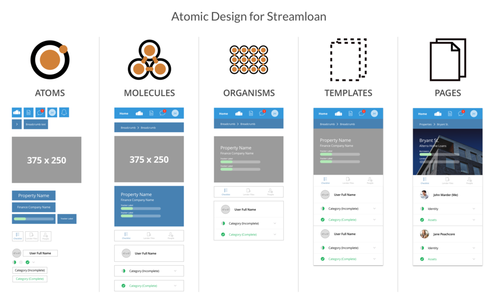

# EventBrite Project !

## The Hacking Project - Version HTML/CSS

L'app ne fait rien pour l'instant. 
Elle contient des views de différents atomes, molécules et organismes.

## ATOMIC DESIGN c'est de la BOMBE !!!

 

***

## Fonctionnalités présentes

* Travaux effectués sur différentes views
* Contient ldes atomes, molécules et organismes
* Certains liens appels d'autres pages html

***

## Installation
Cloner le repository : 
~~~bash
$ git clone https://github.com/gaael/dog-strolling.git
~~~
Ou télécharger sa version compressée puis l'extraire.

***
Ouvrir le fichier index.html et naviguer à l'aide des différents liens.

## Credits
Les ressources de [The Hacking Project](https://www.thehackingproject.org/)\
Les [guides de Rails](https://guides.rubyonrails.org/index.html)

Source de ce README : GAEL DUBOIS, que je remercie.
